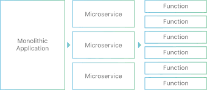
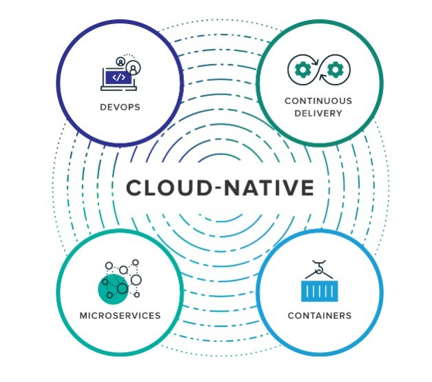
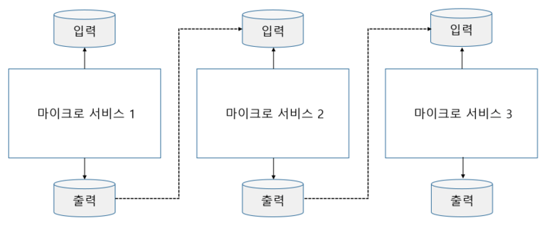

# Chapter2. 마이크로서비스 관련 아키텍쳐 스타일 및 사례

## 1. 12요소 애플리케이션과의 관계
> 클라우드 네이티브 애플리케이션 개발 시, 원칙을 준수하는것이 중요하다
>
 > 클라우드 네이티브 란 클라우드 환경에서 **효율적으로 작동하고, 탄력성, 사용량 기반 과금, 장애 인식** 등과
같은 클라우드의 특징을 인식하고 활욜 할 수 잇는 애플리케이션을 개발 하는 것을 말한다 

> 허로쿠가 제시한 12요소 애플리케이션은 클라우드에서 운영 가능한 현대적인 애플리케이션에서
기대할 수잇는 특징을 기술한 방법론

* 단일코드베이스
* 의존성꾸리머
* 환경설정 외부화
* 후방 지원 서비스 접근성
* 빌드 출시 운영의 격리
*  무상태 비공유 프로세스

### 1.1 단일 코드 베이스
> 각 애플이케이션이 하나의 코드 베이스을 가져야 함
>
> 코드는 깃이나 서브버전과 같은 형상관리 도구를 이용해 관리하며. 이를 이용해 관리되는 코드
베이스는 다른 마이크로 서비스와 공유되지 않는다.

### 1.2 의존성 꾸러미
> 모든 애플리케이션은 필요한 모든 의존성을 애플리케이션과 함께 하나의 꾸러미에 담아야한다
* 메이븐 , 그레이들
* 최종 실행 파일은 WAR 파일이나 실행 가능한 JAR파일로 패키징되며 모든 의존성을 포함

### 1.3 환경설정 외부화
> 운영환경에서 달라지는 이메일ID, 외부시스템 URL, 사용자 이름, 비밀번호, 큐 등은 외부화 되어야 함
* 환경설정을 관리 할 서버를 운용한다

### 1.4 후방 지원 서비스 접근성
> 모든 후방 지원 서비스는 URL을 통해 접근이 가능해야 함.
* 예를들어 메시징 시스템을 통해 이메일을 주고받고, 데이터를 데이터베이스에 저장하는 형태가
외부 지원과 의사소통에 해당함

### 1.5 빌드, 출시, 운영의 격리
> 빌드, 출시, 운영의 격리 원칙에 의하면 빌드, 출시, 운영 단계를 뚜렷하게 격리하는 것이 좋음
    
    
* 빌드,출시, 운영단계로 이뤄진 파이프라인은 일방향이며, 기본적으로 특정 빌드를 건너뛰고
바로 운영단계로 넘기는일이 권장되지않음

* 빌드를 통한 jar 파일 배포 -> 운영 환경 URL 같은 환경정보가 포함되어 출시 버전 생성 -> 출시단에서 만들어낸 컨테이너가 
컨테이너 스케쥴에 의해 운영 환경에 배포

### 1.6 무상태 비공유 프로세스
> 프로세스들이 상태가 없어야 하며 아무것도 공유하지 않는것이 좋음 -> 장애대응성이 좋고 쉽게 확장
> 모든 마이크로 서비스는 상태가 없는 기능을 기반으로 설계되어야 함. 
>
>상태를 저장해야 하는 요구사항이 있다면 데이터베이스나 인메모리 캐시 같은 후방 지원 서비스서
처리되어야함

### 1.7 서비스를 포트에 바인딩해서 노출
> 애플리케이션 자체에 톰캣이나 제티같은 HTTP 리스너가 서비스 자체에 내장되어 있어야하며
> 웹서버에 의존하지 않음. 

### 1.8 확장을 위한 동시성
> 복제를 통해 프로세스가 확장될 수 있게 설계해야 한다. 마이크로 서비스는 수직정 확장이 아닌 수평적 확장
방식으로 확장됨. 
* 수직적 확장 : 서버의 자원은 늘림
* 수평적 확장 : 서비스 인스턴스의 추가복제

### 1.9 폐기 영향 최소화
> 애플리케이션 시동과 종료에 필요한 시간을최소화하고, 서버가 종료될 때에는 종료에 필요한 작업이모두 수행되는 우아한
방식으로 종료되게 만듦. 지연로딩도 고려

* 애플리케이션의 기동과 종료에 오랜 시간이 걸리면 자동화에 영향
* 지연 로딩 : 어떤 리소스를 애플리케이션 시작 시에 무조건 로딩하는 것이 아니라 런타임에서 실제 필요로 하는 시점에 로딩

### 1.10 개발과 운영의 짝맞춤
> 개발환경과 운영환경을 동일하게 맞춤.. 
> 운영환경에서 장애 시 장애 해결을 위해 문제 재연 쉽지 않음

### 1.11 로그 외부화
> 로그 파일을 절대로 자기 자신 안에 담지 않음. 클라우드에서는 로컬 I/O를 피해야함
> 많은 서비스에대한 로그 분산화 우려 로그를 각 인스턴스의 로컬 저장소에 저장하면
 서비스간 로그 연관성 찾기 힘들어짐. 중앙 집중식 로깅 프레임워크필요
 * 스플렁크, 그레이로그, 로그스태쉬, 로그플랙스, 로글래,
 
 
 ### 1.12 관리자 프로레스 패키징
 > 대부분 애플리케이션에는 관리자용 테스크도 포함됨. 이런 관리자용 테스크는 애플리케이션
 본연의 서비스를 실행하는 프로세스와 동일한 환경에서 실행되어야 함.
 
 
 ## 2 서버리스 컴퓨팅
 > 개발자가 애플리케이션 서버, 가상머신, 컨테이너, 인프라 스트럭처 확장성 고민 필요 없음
 
>
>
>개발자는 비즈니스 로직을 담고잇는 함수를 작성해서 현재 실행되고 있는 컴퓨팅 인프라 스트럭쳐에 
떨구기만 하면 된다.

> 서버리스 함수는 마이크로서비스처럼 작은 공간만 차지함--

## 3.람다 아키텍쳐

## 4. 삼총사의 만남: 데브옵스, 클라우드, 마이크로서비스. 구현
> 마이크로 서비스를 효과적으로 구현하기 위해 클라우드와 데브옵스가 필요
>

> 조직의 목표는 비용 효율적인 방식으로 신속한 변경 및 배포와 높은 품질을 달성하는 것이고,
마이크로서비스 클라우드 데브옵스 삼총사는 그런목표를 달성하는데 커다란 도움이 됨

### 4.1 마이크로서비스 실천 방식과 프로세서로서의 데브옵스
> 마이크로서비스는 신속한 변경 및 배포가 가능해야함 -> 데브옵스

### 4.2 마이크로서비스를 위한 셀프 서비스 인프라스트럭처로서의 클라우드 
> 클러스터 관리 소프트웨어를 사용하는 클라우드 인프라스트럭처 없이는 마이크로서비스를 
배포할 때 소요되는 인프라스트럭처 비용을 통제하기 어려움, 그래서 마이크로서비스를
통해 얻을 수 잇는 장점을충분히 활용하려면 셀프서비스 역량을 갖춘 클라우드가 필수적

> 클라우드는 동적 프로비저닝과 배포 자동화를 위한 API를 제공하기도 함
이를 코드로서의 인프라스트럭처 또는 소프트웨어정의 인프라스트럭처 라고함

### 5. 리엑티브 마이크로서비스
> 동기 호출 방식은 서비스 간 협력시 강한 의존관계를 가지게 함 
> 따라서 서비스 통신 방식을 비동기로 설계하는것이 중요함.

> 각 마이크로 서비스는 서로를 모르며 이벤트를 리스닝하며 처리하여 응답 이벤트를 발생시켜 전파 시키는 방식

* 큐빗, 스프링 리액티브, 알엑스자바, 알엑스제이에스
* 스프링을 이용해여 마이크로서비스를 구축하려면 스프링 클라우드 스트림을 사용하는 것이좋음
